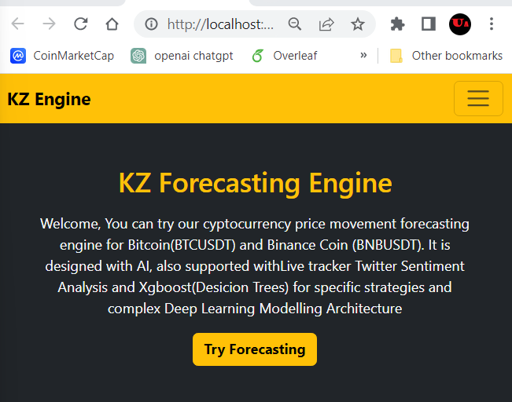

# Frontend Part for KZ Forecasting Engine

Necessary Information will be added in the next weeks.

Welcome, You can try our cyptocurrency price movement forecasting 
engine for Bitcoin(BTCUSDT) and Binance Coin (BNBUSDT). 
It is designed with AI, also supported with Live tracker 
Twitter Sentiment Analysis and Xgboost(Desicion Trees) for 
specific strategies and complex Deep Learning Modelling Architecture

In the project directory, you can run:

### `npm start`
Open [http://localhost:3000](http://localhost:3000) to view it in your browser.

